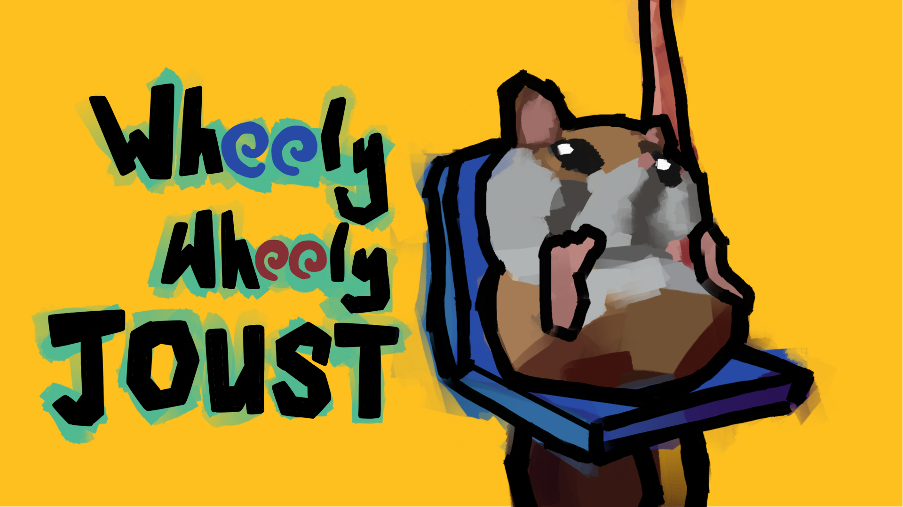
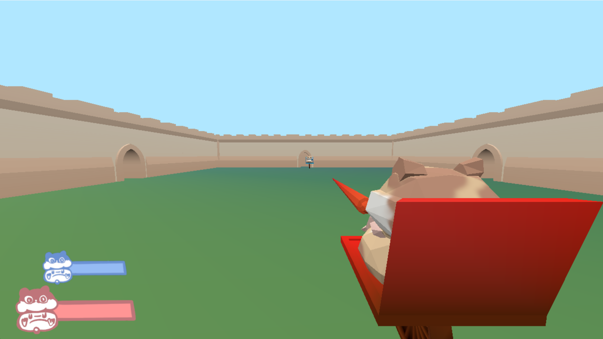

# Wheely Wheely Joust

Author: Weiwen "Andy" Jiang

Design: Two hamsters duking it out on some broken unichair. What for? Who knows.

Networking: Networking works pretty similar to the base code. However, before the game begins, every connection player pair has the player
as a nullptr. When a player presses 'E' on the main menu, the player sends a handshake message to the server, and the server assign the player either player1 (red hamster)
or player2 (blue hamster). If the game is full (2 players readied up), additional players in the server will become spectators and view from a top down stationary camera.
When an active player (non-spectator) disconnects, the entire game is sent back to the menu and players need to resend their handshake signal.

Screen Shot:

How To Play:

Press 'E' to ready.
Press 'WASD' to move.
Hold 'Space' to adjust lance angle.
Press 'LMB' to attack.
Move Mouse to look around.
Reduce your opponent's health to 0 to win!

Sources:
Arena walls from Kenny: https://kenney.nl/assets/castle-kit.
Fredoka Font: https://github.com/hafontia/Fredoka-One.

This game was built with [NEST](NEST.md).

